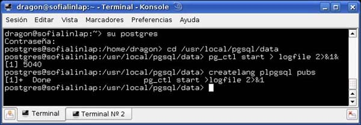
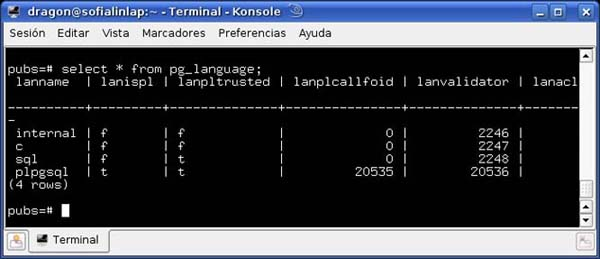
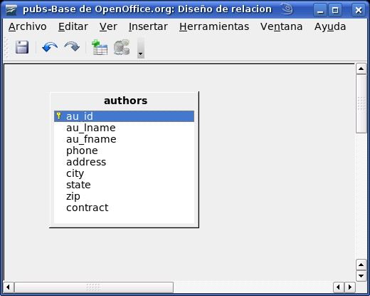
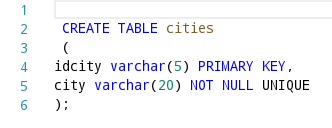
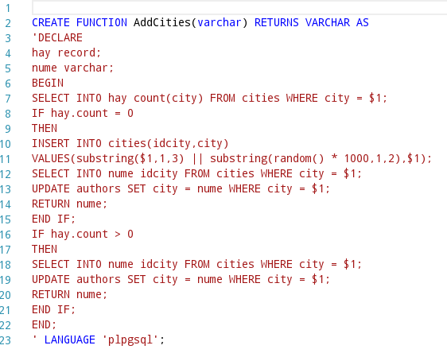
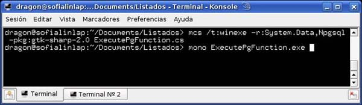
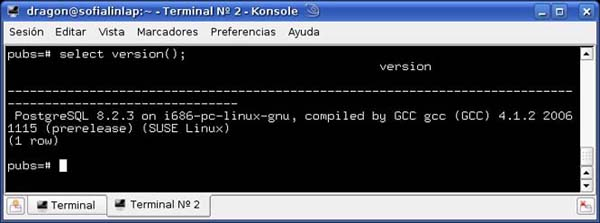
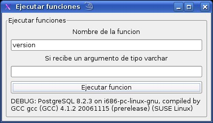
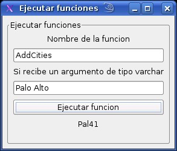

# Uso de funciones PL/SQL en PostgreSQL

Una función (function) en PostgreSQL son sentencias SQL agrupadas y precompiladas para ejecutarse en bloque dentro del servidor, a diferencia de las consultas SQL donde cada consulta es procesada en tiempo de ejecución por el servidor , las funciones procedurales son compilados cuando son creados, ya que el servidor asume que serán ejecutados más de una vez, un función ofrece las siguientes ventajas:
<ul>
<li>
No sobrecarga la comunicación cliente/servidor al evitar enviar una consulta tras otra, en su lugar procesa una consulta tras otra y envía únicamente el resultado.
</li>
<li>
Cuando y se ejecuta la primera vez se crea un plan preparado de ejecución, las siguientes ejecuciones reutilizan el plan preparado.
</li>
<li>
Agrega estructuras de control y capacidad de calculo al lenguaje SQL.
</li>
<li>
Las mismas consultas están disponibles para varias aplicaciones.
</li>
<li>
Seguridad los datos solo están accesibles mediante las funciones y evita el uso de SQL injection.
</li>
</ul>

De los lenguajes más utilizados para crear funciones en postgreSQL, se encuentra PL/pgSQL, el cual se distribuye como un módulo cargable junto con postgreSQL, para emplearlo en nuestra base de datos es necesario darlo de alta, de la siguiente manera.

Fig 1 Agregando el soporte PL/SQL

Revisamos si ya lo tenemos disponible en nuestra base de datos para utilizarlo La sintaxis de PL/pgSQL (similar al lenguaje PL/SQL de Oracle)

Fig 2 Comprobando la instalación del lenguaje PL/SQL

	

Utilizando PL/pgSQL con C#

En este ejemplo usaremos PL/pgSQL y C# para resolver un requerimiento practico como seria relacionar la columna city de nuestra tabla authors en nuestra base de datos con una tabla llamada cities donde se encontrará la información de la columna ciudad mas un identificador.

Fig 3 La tabla autores

	

La relación deberá de quedar de la siguiente manera, donde la columna city se debe cambiar por la clave primaria de la tabla cities que tendrá como clave primaria la clave de la ciudad y una columna adicional llamada city que contendrá el nombre de la ciudad.

	

Ahora usamos la siguiente función AddCities(varchar) para tomar los valores de la columna city en la tabla authors, crear un identificador único para la llave primaria, insertar ese valor de clave primaria junto con el nombre de la ciudad y por último sustituir los valores en la columna city y reemplazarlos con el valor de la llave primaria en la tabla cities.

	

Lo compilamos y lo ejecutamos

    mcs /t:winexe -r:System.Data,Npgsql -pkg:gtk-sharp-2.0 ExecutePgFunction.cs
Fig 5 Compilación del programa

	

Podemos probar nuestro programa invocando la funcion version() predeterminada de PostgreSQL.

Fig 6 Ejecutando la función version() de PostgreSQL

	

Al ejecutar la función sin argumentos desde el formulario se vera el mismo resultado.

Fig 7 El programa ejecutando función version().

	

Aquí el driver de PostgreSQL para .NET ejecuta la función usando la clase NpgsqlCommand la cual recibe como argumento el nombre de la función y la conexión al servidor donde se encuentra.

    NpgsqlCommand cmd = new NpgsqlCommand(“version”, conn);
Si la función recibe parámetros, debemos de crear una instancia de la clase NpgsqlParameter() por cada uno de los parametros que reciba, es muy importante no olvidar indicarle a la clase NpgsqlCommand que el comando que ejecutaremos es un stored procedure o una función pl/sql, esto lo hacemos mediante la instrucción:

    cmd.CommandType = System.Data.CommandType.StoredProcedure;
Para mayor referencia no olvidar leer la documentación del data provider para PostgreSQL. Si todo es ejecutado correctamente, ya podemos probar la función AddCities con el argumento del nombre de la ciudad y debe devolvernos la clave primaria de la tabla cities.

Fig 8 El programa ejecutando la función AddCities

	

